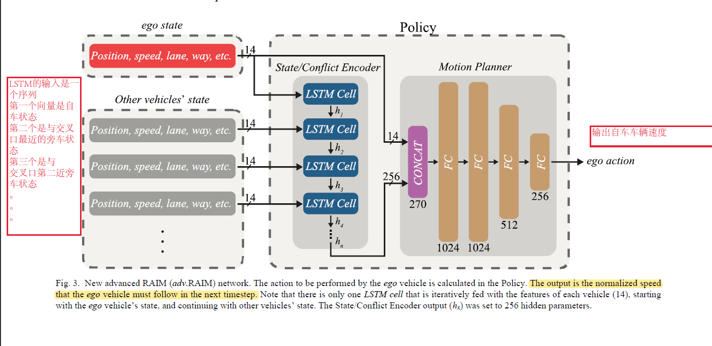
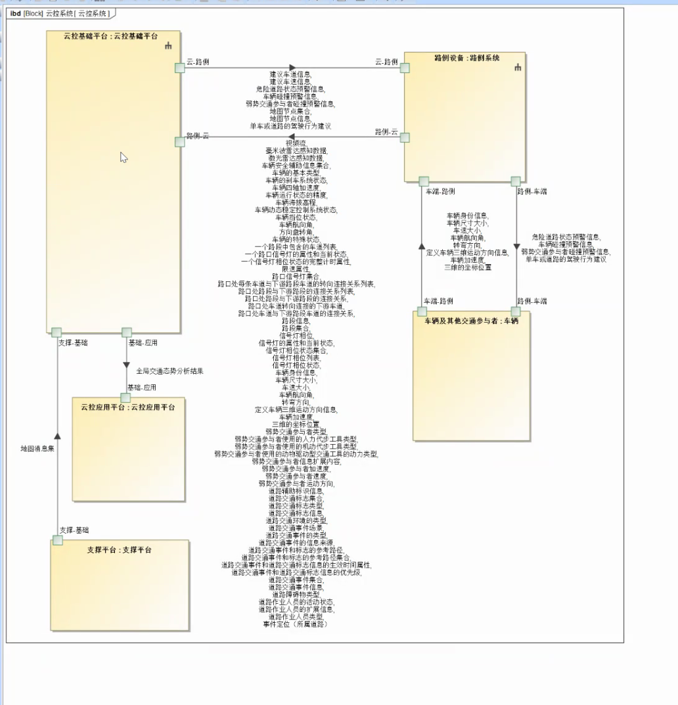

# 5.8
RNN代码\
GIRL理论\
GAN代码

# 5.9
PPO算法的证明\
TRPO/PPO笔记\
滑动平均\
广义优势函数\
PPO代码

# 5.10
sumo的学习，实例代码的编写\
MPC与RL的关系\
贝叶斯SVM的视角看SVM\

# 5.12
gym 的各种包装器\
pytorch lt库的学习\
python面向对象中typing的学习\
optuna学习

# 5.13
博弈论\
python精炼\
matplotlib精炼\
github创建仓库及使用\
Dataset、Tensordata、Datloader的代码

# 5.13
VAE项目代码：观测模型与PF滤波器代码的编写

# 5.15

1、python模块编程文件路径\
2、CNN\RNN\MLP的单元测试\
3、LSTM做交叉口控制的论文（输入时当前车和附近车的一个\状态向量序列）、输出是当前车的推荐速度 Multi-Agent Deep Reinforcement Learning to Manage Connected Autonomous Vehicles at Tomorrow’s Intersections\

4、MPC+RL，用DL学一个环境模型，然后随机撒点解MPC  Addressing crash-imminent situations caused by human driven vehicle errors in a mixed traffic stream: a model-based reinforcement learning approach for CAV\

5、交叉口MPC问题，由于约束太多不好解，把问题转化为无约束问题，然后用RL的方法学习一个状态s到a的映射。状态s被构造为41-d向量，由6-d自车状态、与自车存在潜在冲突的8辆车辆中的每辆车辆的4-d向量和参考路径的3-d向量组成（6+4*8+3），包括位置、速度和航向的跟踪误差 ,Learn collision-free self-driving skills at urban intersections with model-based reinforcement learning\

# 5.16 CPS会议
## 整个研究的流程是
### 1.定义需求：
1.利益攸关者需求\
2.安全需求\
3.战略需求\
4.服务需求\
5.标准化需求\
6.系统需求:产业级规划与分析（中心云）、区域交通应用（区域云）、边缘级车辆智能驾驶需求（边缘云）\
7.防护需求\
8.需求追溯关系（建立不同需求之间的追溯关系，也就是画一个邻接矩阵）

### 2.定义功能：（不同场景对应不同功能）
1.安全功能\
2.标准化功能\
3.防护功能\
4.服务功能\
5.利益攸关者功能\
6.系统功能（我们关注的重点），我们重点关注车路协同智能驾驶（又可分为道路安全预警、智能驾驶、协同驾驶），其中道路安全预警这些模块又可以继续细分，对于组内涉及到的应用，我们把他的颗粒度可以做细（如果是感知黑盒的画就不考虑系统内部结构，如果是simulink模型，可以继续细化，这样可以形成追溯），对于组内不涉及的应用，可以不太关注，交给外包。

7.
### 3.定义逻辑：（包含在功能定义之内了，对应较细的颗粒度，其实可以理解为是画一个状态机出来）

### 4.定义物理层：（同样在功能定义之内，可以理解为状态机内部更细的物理模型）

## NOTE：
杜老师的架构可以给我们直接复用，我们需要结合我们的应用再往下探，我需要把顶层的架构做填空，结合我们的东西做一下修改。\
他这个软件只能定义一些计算，如果涉及到矩阵计算矩阵切片等就不好弄了\
算法还是要用matlab或者python写\
