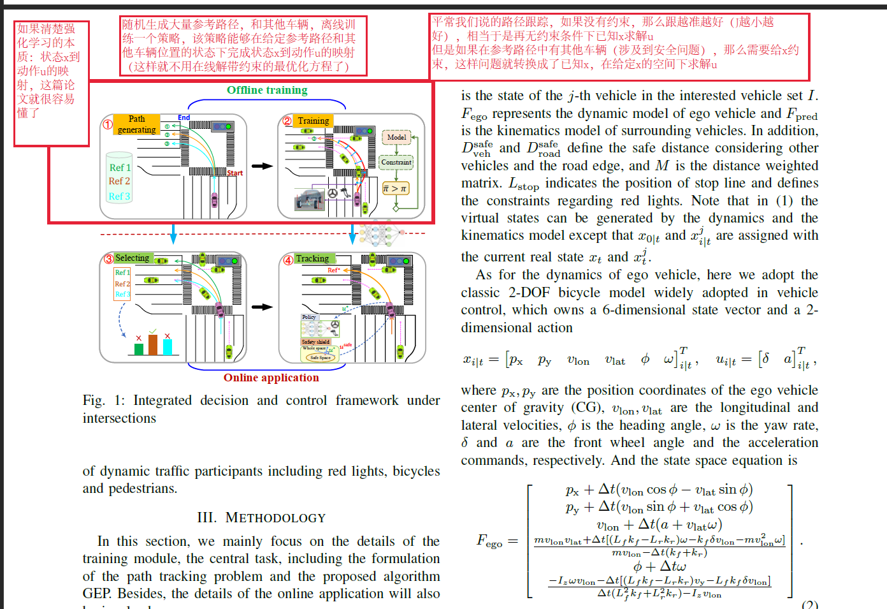
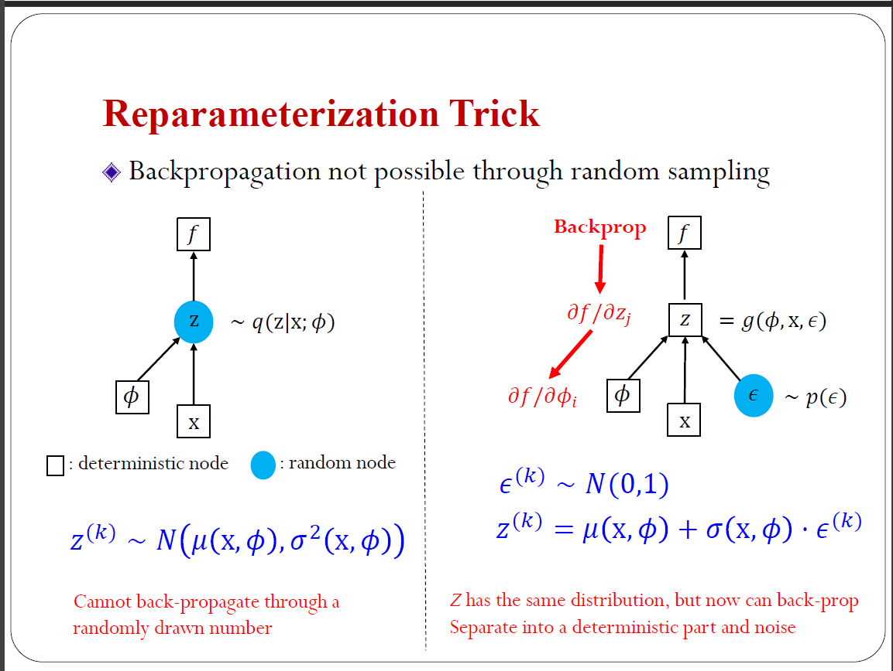
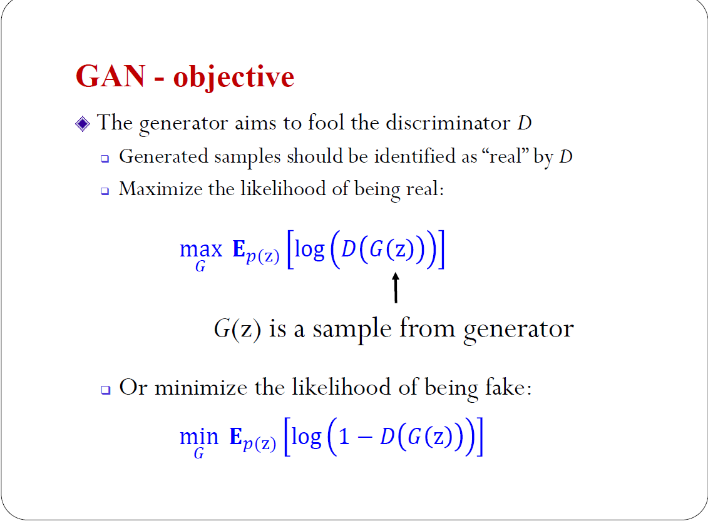

# 5.8
RNN代码\
GIRL理论\
GAN代码

# 5.9
PPO算法的证明\
TRPO/PPO笔记\
滑动平均\
广义优势函数\
PPO代码

# 5.10
sumo的学习，实例代码的编写\
MPC与RL的关系\
贝叶斯SVM的视角看SVM\

# 5.12
gym 的各种包装器\
pytorch lt库的学习\
python面向对象中typing的学习\
optuna学习

# 5.13
博弈论\
python精炼\
matplotlib精炼\
github创建仓库及使用\
Dataset、Tensordata、Datloader的代码

# 5.13
VAE项目代码：观测模型与PF滤波器代码的编写

# 5.15

1、python模块编程文件路径\
2、CNN\RNN\MLP的单元测试\
3、LSTM做交叉口控制的论文（输入时当前车和附近车的一个\状态向量序列）、输出是当前车的推荐速度 Multi-Agent Deep Reinforcement Learning to Manage Connected Autonomous Vehicles at Tomorrow’s Intersections\

4、MPC+RL，用DL学一个环境模型，然后随机撒点解MPC  Addressing crash-imminent situations caused by human driven vehicle errors in a mixed traffic stream: a model-based reinforcement learning approach for CAV\

5、交叉口MPC问题，由于约束太多不好解，把问题转化为无约束问题，然后用RL的方法学习一个状态s到a的映射。状态s被构造为41-d向量，由6-d自车状态、与自车存在潜在冲突的8辆车辆中的每辆车辆的4-d向量和参考路径的3-d向量组成（6+4*8+3），包括位置、速度和航向的跟踪误差 ,Learn collision-free self-driving skills at urban intersections with model-based reinforcement learning\

# 5.16 CPS会议
## 整个研究的流程是
### 1.定义需求：
1.利益攸关者需求\
2.安全需求\
3.战略需求\
4.服务需求\
5.标准化需求\
6.系统需求:产业级规划与分析（中心云）、区域交通应用（区域云）、边缘级车辆智能驾驶需求（边缘云）\
7.防护需求\
8.需求追溯关系（建立不同需求之间的追溯关系，也就是画一个邻接矩阵）

### 2.定义功能：（不同场景对应不同功能）
1.安全功能\
2.标准化功能\
3.防护功能\
4.服务功能\
5.利益攸关者功能\
6.系统功能（我们关注的重点），我们重点关注车路协同智能驾驶（又可分为道路安全预警、智能驾驶、协同驾驶），其中道路安全预警这些模块又可以继续细分，对于组内涉及到的应用，我们把他的颗粒度可以做细（如果是感知黑盒的画就不考虑系统内部结构，如果是simulink模型，可以继续细化，这样可以形成追溯），对于组内不涉及的应用，可以不太关注，交给外包。

7.
### 3.定义逻辑：（包含在功能定义之内了，对应较细的颗粒度，其实可以理解为是画一个状态机出来）

### 4.定义物理层：（同样在功能定义之内，可以理解为状态机内部更细的物理模型）

## NOTE：
杜老师的架构可以给我们直接复用，我们需要结合我们的应用再往下探，我需要把顶层的架构做填空，结合我们的东西做一下修改。\
他这个软件只能定义一些计算，如果涉及到矩阵计算矩阵切片等就不好弄了\
算法还是要用matlab或者python写\

# 5.17 
## 1统计学习课程总结
**1** .深度生成模型和深度判别模型是不同的，深度判别模型是传统的神经网络，比如CNN RNN等\
**2** .深度生成模型主要用在无监督任务和半监督任务上
**3** .VAE：主要关注重参数化技巧\

**4** .GAN：主要关注目标函数

 GAN-D判别器目标函数 

 GAN-G生成器目标函数 

 GAN-判别器生成器合并后的目标函数（其实是一种JS divergence between） 

**4.1** GAN的一些前沿Topic\
**(1)** 用控制论拉普拉斯变换来这证明稳定性\
**(2)** triple GAN ：用GAN来解决半监督学习问题\

**5.** FLOW模型：主要关注反函数原理\
**(1)** 我们有了p(z)的概率密度函数，我们又知道x=g(z)，现在我们想要求得x的概率密度函数，具体方法如下\

 det |雅可比矩阵| 表示雅可比矩阵的行列式的值 

 FLOW模型一般假设的变换的形式很简单，主要是为了让雅可比矩阵为对角阵，这也导致模型的表示能力不强，所以需要多叠几层，这也是为什么称为“流”模型 
\

**(2)** FLOW模型有一个缺陷就是，每叠一层就要重新reshape到低维（输入的维度）这是为了保持雅可比矩阵为对角阵，这也导致网络变成  胖->瘦->胖->瘦交替的形式。VFLOW模型解决了这个问题，它不要求雅可比矩阵为对角阵，这样可以用更少的层数达到同样的效果。、

**6.** 珠算：概率编程库，从概率图的视角来编程\

## 2关于控制的一些感想
**7.** 开环控制与闭环控制\
开环控制是指在模型非常精确的情况下，给定初始状态，对于想要达到的目标状态，可知直接求得一个控制序列出来。\
闭环控制是指每次控制的时候参考当前的状态，也就是有状态反馈\

一个例子:\
MPC中在一个时域内预测的过程可以看作是一个开环控制（用当前状态，根据系统模型，往后预测n个状态，求出一个有n个控制量的序列，但是只作用第一个控制量）\
在时域与时域之间，也就是对应现实中两个状态，属于闭环控制，因为每一次控制都需要参考当前的状态，因此MPC可以说是时域内开环，整个系统闭环\

## 3代码实战
数据集自定义流程、auto encoder、VAE的代码实现（见[龙曲良老师实战代码](https://github.com/dragen1860/Deep-Learning-with-PyTorch-Tutorials)，[龙曲良老师实战课程](https://www.bilibili.com/video/BV11r4y1e76A?p=114&spm_id_from=pageDriver)）
