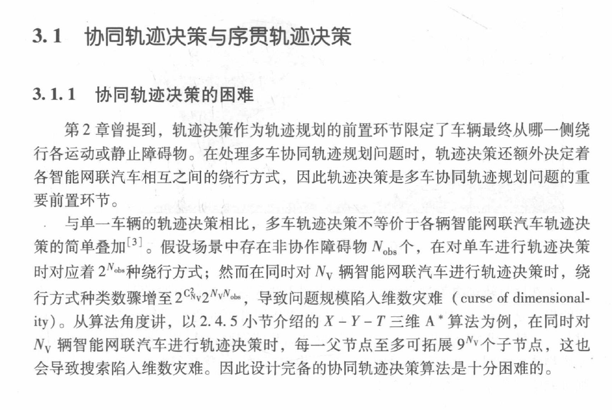
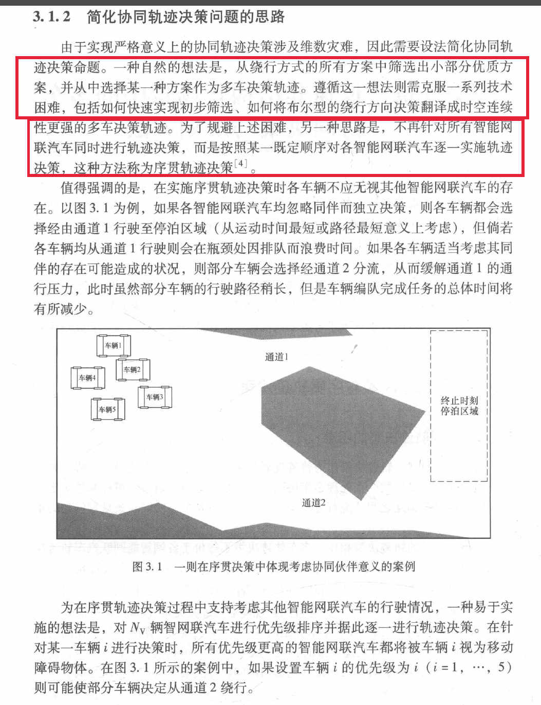
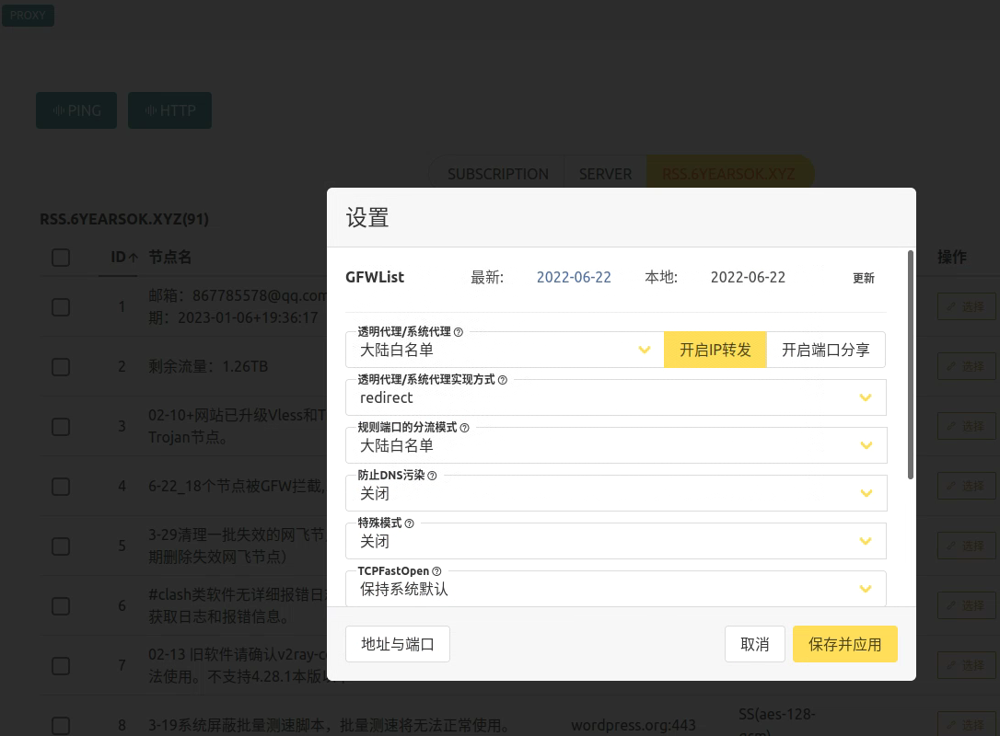
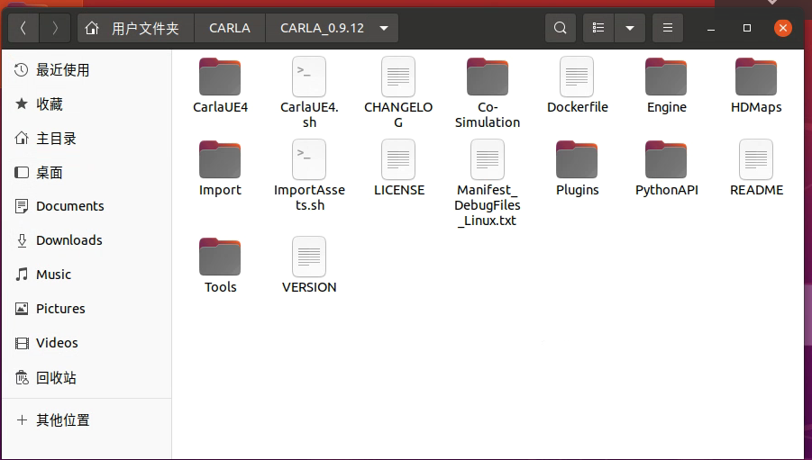
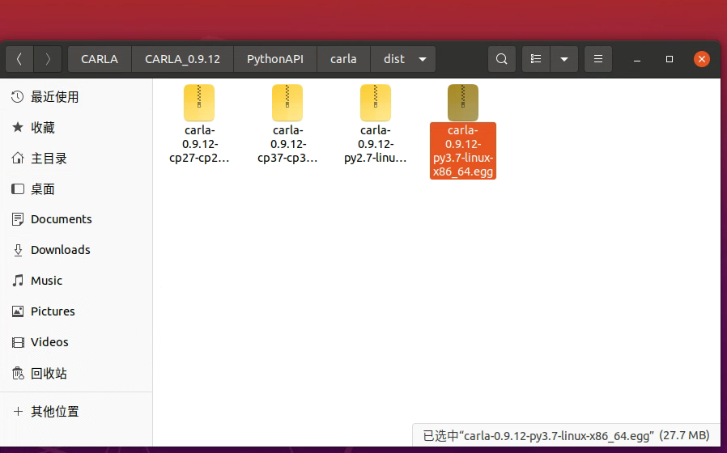
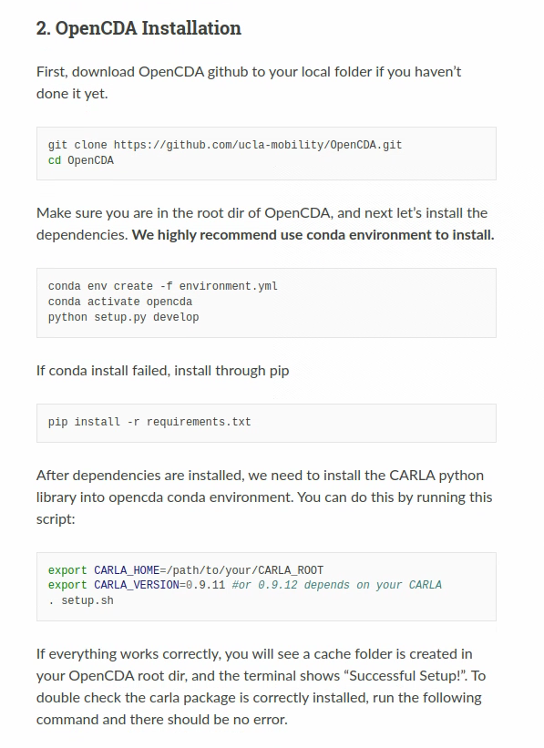
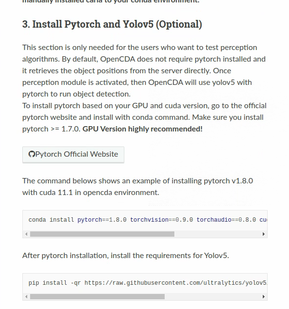
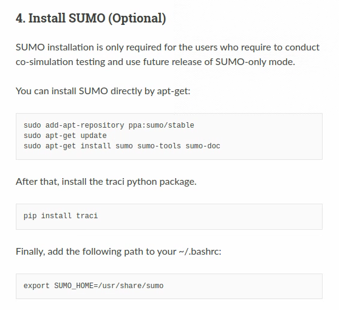
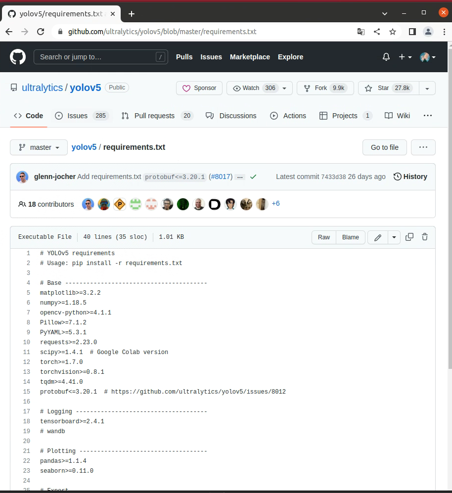

# 6.20
1. 大数据竞赛
2. 论文阅读\
   （1）智能网联汽车协同决策与规划技术

       
       

# 6.23
## linux vpn的安装
按照网站上的提示走，不执行添加V2rayA软件源和更新V2rayA，安装V2rayA这几步，参考知乎帖子方法二：手动安装 deb 包进行安装。

 

按照提示进入github，下载如下文件，然后需要进行安装sudo apt install _xxx_vxxx.deb

 

最后按照提示进行开机自启动和浏览器的设置即可。（注意，在浏览器打开时候，需要设置成大陆白名单）
 

## carla、OPENCDA联合仿真
### 1） carla的安装
参考B站视频：\
https://www.bilibili.com/video/BV13T4y1U71D/?spm_id_from=333.788&vd_source=d31a858cc26ae1ffa19e14058b339f40

注意：不需要安装unreal，也不需要编译安装，只需要在GitHub上找到realease的安装包解压即可（大约需要6G+3G的空间）。解压后由于后续OPENCDA需要用到TOWN6地图，所以最好把附加的地图也下载下来，将安装包解压到carla的安装文件夹下，替换掉重复的文件（CarlaUE4和Engine）
       

另外还需要配置环境变量，最好conda create一个carla专属环境

 

如果上述环境变量配置不好，import carla报错，可以输入下列命令：
 
也可以参考视频后边段：
https://www.bilibili.com/video/BV1BQ4y167dq?spm_id_from=333.788.top_right_bar_window_history.content.click&vd_source=d31a858cc26ae1ffa19e14058b339f40

在终端运行 ./CarlaUE4.sh 即可启动carla/
测试是否安装成功，进入到pythonAPI-example文件夹下，输入 python maual_control.py测试

### 2） OPENCDA的安装
参考官网opencda
 
 
 
注意：安装pytorch的版本，cuda一定要是10.1，pytorch版本不所谓只要大于1.8就可以。安装yolov5时，可能等待时间过长,可以去网站上把requirement.txt下载下来

在和sumo pytorch联合仿真时会报错没有traci.sumolib这个属性，这时候需要去改代码，找到报错的文件，在304行处，把traci.sumolib改为sumolib

