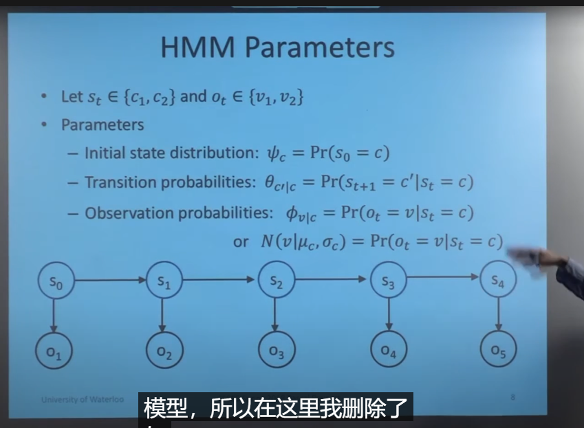

# 7.1

## 1. apollo强化学习规划算法的学习
B站视频：https://www.bilibili.com/video/BV1Qt4y1s7D8?spm_id_from=333.999.header_right.history_list.click&vd_source=d31a858cc26ae1ffa19e14058b339f40

思路：apollo 用强化学习做规划的方法主要是借鉴了Google的ChauffeurNet，是一种mid-mid的模型，输入是9个通道的语义地图，输出是三秒内的轨迹点。

对于强化学习输出的轨迹点，需要进行平滑和轨迹拼接，最后输出给控制模块。强化学习规划相当于整合了预测和规划两个模块，不再依赖于预测。

# 7.10

## POMDP
* 状态转移过程
   
* 目标以及定义
  
* 进一步简化
  
  
  有一个错误（reward and observation）

  
  
  
   
   HMM前向后向算法
   
   
   

## LQR和LQG
* LQR的控制为u=-Kx
* LQG相对于LQR来说只是引入了过程噪声和观测噪声，先用kalman滤波器观测出状态的最优估计$x^{hat}$，然后u=-K$x^{hat}$
  
  
  

# 7.15
## 和高老师会议讨论讨论
* 1.高精度地图的位置应该放到映射和预测之间
* 2.POMDP先不考虑不确定性，先考虑周车的确定性意图（先把整个框架流程跑通）
* 3.把信号灯集成到终端约束里
* 4.取消准备区的说法

# 7.16 今天出去滑冰了，休息一天，主要了解了以下轨迹优化

# 7.17 最优控制的解法
* 最优控制的解法可以包含间接法和直接法。
* 间接法主要指的是先优化再离散的一些算法，比如变分法、极小值原理、动态规划，间接法由于计算量太大，难以解决复杂问题，一般不用。
* 直接法主要指的是先离散再优化的算法，包括两大类（1）打靶法和（2）配点法
* 打靶法包括单次打靶、多次打靶、MPC等，主要是通过把动力学约束转化到cost中，然后只优化控制变量。
* 配点法包括直接配点、维谱法等，主要是离散化状态量和控制量。约束也做相应的离散化。
  

Reference:
https://zhuanlan.zhihu.com/p/340981788  CMU课程PPT
https://zhuanlan.zhihu.com/p/492906065
https://zhuanlan.zhihu.com/p/346617896
https://blog.csdn.net/qq_35007540/article/details/105672547   关于配点法的描述
https://zhuanlan.zhihu.com/p/434984223
https://zhuanlan.zhihu.com/p/51372134  关于自动驾驶轨迹规划的一些总结
https://blog.csdn.net/NICAI001/article/details/119270814
