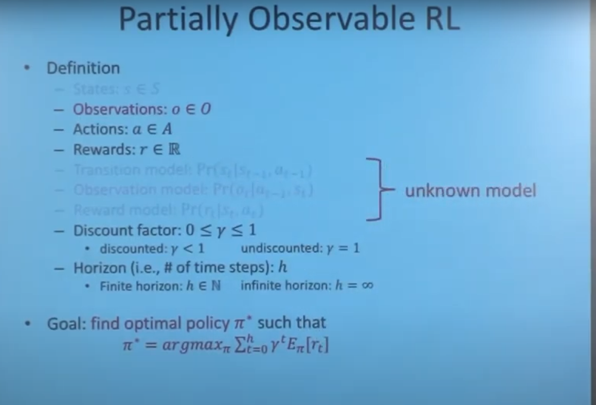
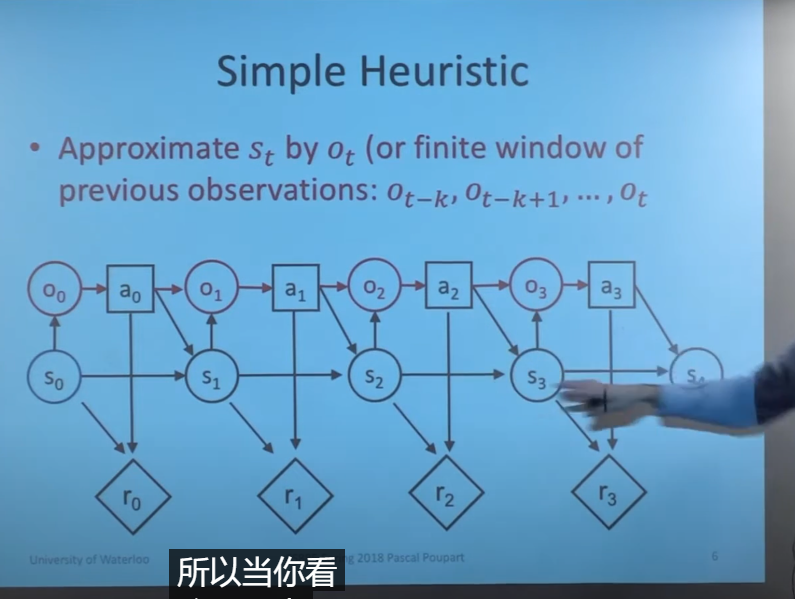
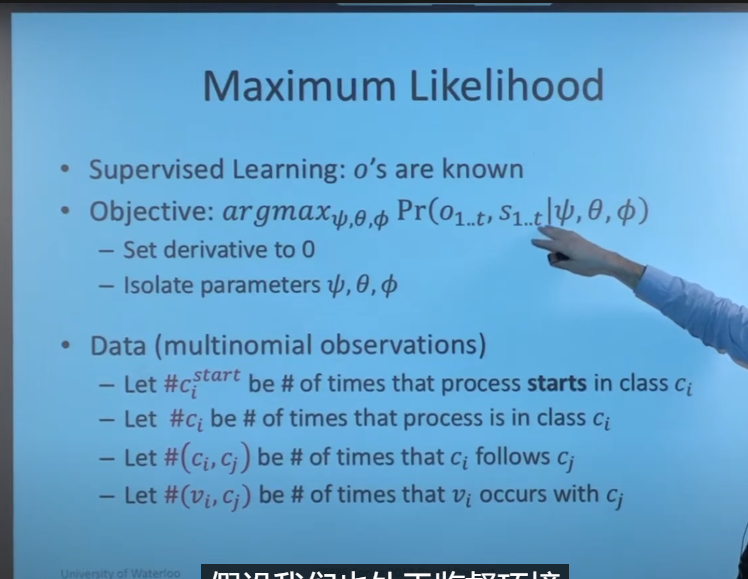
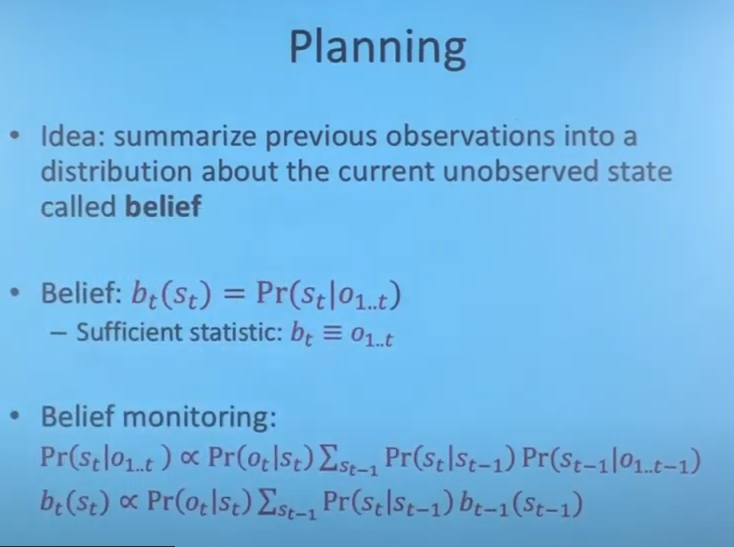

# 7.1

## 1. apollo强化学习规划算法的学习
B站视频：https://www.bilibili.com/video/BV1Qt4y1s7D8?spm_id_from=333.999.header_right.history_list.click&vd_source=d31a858cc26ae1ffa19e14058b339f40

思路：apollo 用强化学习做规划的方法主要是借鉴了Google的ChauffeurNet，是一种mid-mid的模型，输入是9个通道的语义地图，输出是三秒内的轨迹点。

对于强化学习输出的轨迹点，需要进行平滑和轨迹拼接，最后输出给控制模块。强化学习规划相当于整合了预测和规划两个模块，不再依赖于预测。

# 7.10

## POMDP
* 状态转移过程
   
* 目标以及定义
  
* 进一步简化
  
  
  有一个错误（reward and observation）

  
  
  
   
   HMM前向后向算法
   
   
   

## LQR和LQG
* LQR的控制为u=-Kx
* LQG相对于LQR来说只是引入了过程噪声和观测噪声，先用kalman滤波器观测出状态的最优估计$x^{hat}$，然后u=-K$x^{hat}$
  
  
  